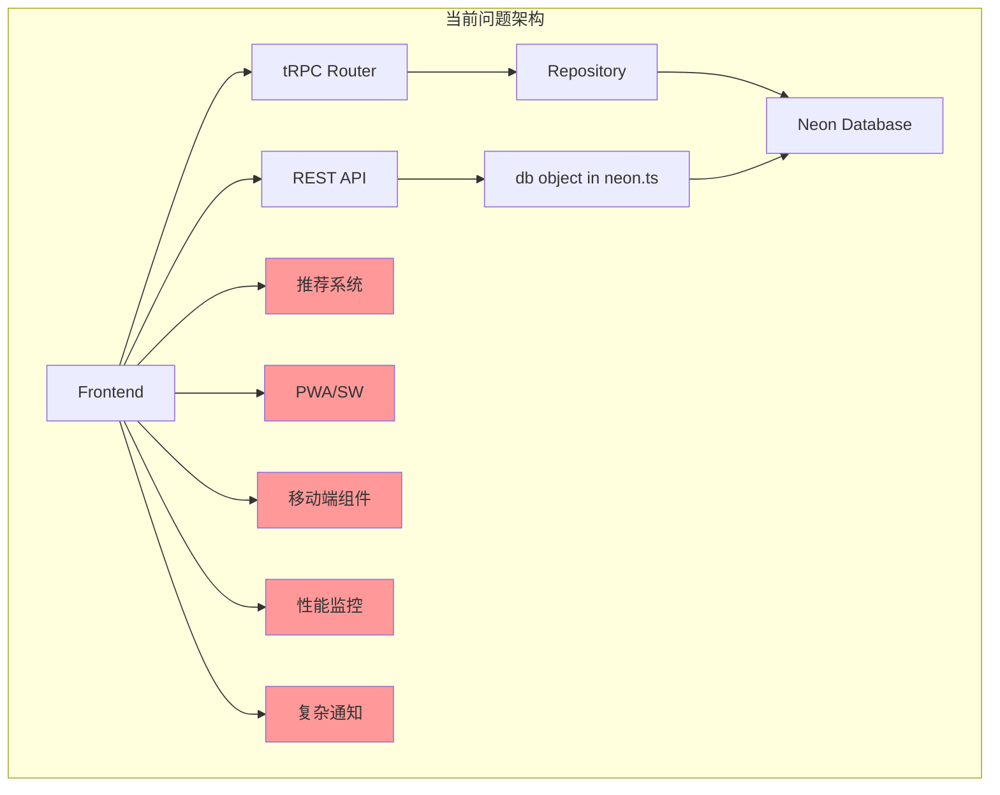
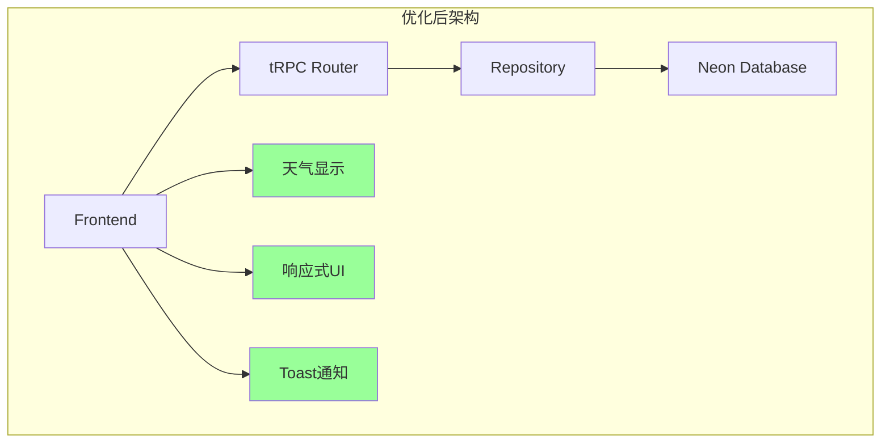

# Design Document - QMS 项目代码质量改进

## Overview

本设计文档描述了 QMS（被子管理系统）项目的代码质量改进方案。基于需求文档中识别的问题，本设计将分阶段实施代码清理、架构优化和功能简化。

**核心目标**：

1. 删除不准确的推荐系统（保留天气功能）
2. 删除未完成的 PWA 功能
3. 简化移动端组件（使用响应式设计）
4. 删除开发专用的性能监控
5. 简化通知系统
6. 优化数据库查询效率
7. 统一类型定义
8. 清理冗余代码和 API

## Architecture

### 当前架构问题



### 目标架构



### 数据访问层优化

当前 `neon.ts` 中的 `db` 对象和 `QuiltRepository` 类存在功能重复。优化后将：

1. 移除 `neon.ts` 中的 `db` 对象
2. 统一使用 Repository 模式
3. 在 Repository 中实现数据库级别的过滤和分页

## Components and Interfaces

### 需要删除的组件

| 组件路径                                                  | 原因       |
| --------------------------------------------------------- | ---------- |
| `src/components/seasonal/SeasonalRecommendations.tsx`     | 推荐不准确 |
| `src/components/seasonal/WeatherBasedSuggestions.tsx`     | 推荐不准确 |
| `src/components/seasonal/UsagePatternAnalysis.tsx`        | 推荐不准确 |
| `src/components/dashboard/QuiltRecommendation.tsx`        | 推荐不准确 |
| `src/components/dashboard/QuiltRecommendationContent.tsx` | 推荐不准确 |
| `src/lib/quilt-recommendation.ts`                         | 推荐算法   |
| `src/lib/serviceWorker.ts`                                | PWA 未完成 |
| `src/components/ServiceWorkerRegistration.tsx`            | PWA 未完成 |
| `src/components/mobile/PWAInstallPrompt.tsx`              | PWA 未完成 |
| `src/components/mobile/OfflineIndicator.tsx`              | PWA 未完成 |
| `src/components/mobile/MobileDashboard.tsx`               | 重复组件   |
| `src/components/mobile/MobileQuiltList.tsx`               | 重复组件   |
| `src/components/dashboard/PerformanceMonitor.tsx`         | 开发功能   |
| `src/hooks/usePerformance.ts`                             | 开发功能   |
| `src/hooks/useMobileGestures.ts`                          | 过度设计   |

### 需要保留的天气组件

| 组件路径                                     | 功能       |
| -------------------------------------------- | ---------- |
| `src/components/weather/WeatherWidget.tsx`   | 天气小部件 |
| `src/components/weather/WeatherForecast.tsx` | 天气预报   |
| `src/lib/weather-service.ts`                 | 天气服务   |
| `src/hooks/useWeather.ts`                    | 天气 Hook  |
| `src/hooks/useHistoricalWeather.ts`          | 历史天气   |
| `src/app/api/weather/`                       | 天气 API   |
| `src/types/weather.ts`                       | 天气类型   |

### 需要删除的 API 路由

| 路由路径                                   | 原因         |
| ------------------------------------------ | ------------ |
| `src/app/api/admin/check-db-schema/`       | 一次性迁移   |
| `src/app/api/admin/drop-old-usage-tables/` | 一次性迁移   |
| `src/app/api/admin/init-settings/`         | 一次性迁移   |
| `src/app/api/admin/migrate-status/`        | 一次性迁移   |
| `src/app/api/admin/migrate-usage-records/` | 一次性迁移   |
| `src/app/api/admin/update-quilt-names/`    | 一次性迁移   |
| `src/app/api/test/`                        | 测试端点     |
| `src/app/api/test-quilts/`                 | 测试端点     |
| `src/app/api/db-test/`                     | 测试端点     |
| `src/app/api/migrate/`                     | 迁移端点     |
| `src/app/api/metrics/`                     | 开发功能     |
| `src/app/api/dashboard/stats/`             | 与 tRPC 重复 |

### 接口优化

#### QuiltRepository 接口优化

```typescript
// 优化后的 findAll 方法 - 在数据库层面过滤
async findAll(filters: QuiltFilters = {}): Promise<Quilt[]> {
  const { season, status, location, brand, search, limit = 20, offset = 0 } = filters;

  // 构建动态 WHERE 子句
  const conditions: string[] = [];
  const params: any[] = [];

  if (season) {
    conditions.push(`season = $${params.length + 1}`);
    params.push(season);
  }

  if (status) {
    conditions.push(`current_status = $${params.length + 1}`);
    params.push(status);
  }

  // ... 其他过滤条件

  const whereClause = conditions.length > 0
    ? `WHERE ${conditions.join(' AND ')}`
    : '';

  const rows = await sql`
    SELECT * FROM quilts
    ${whereClause}
    ORDER BY created_at DESC
    LIMIT ${limit} OFFSET ${offset}
  `;

  return rows.map(row => this.rowToModel(row));
}
```

## Data Models

### 统一类型定义

当前存在三处类型定义不一致：

- `src/types/quilt.ts` - 前端类型
- `src/lib/database/types.ts` - 数据库类型
- `src/lib/validations/quilt.ts` - Zod schema

**优化方案**：以 Zod schema 为单一来源，推导所有类型

```typescript
// src/lib/validations/quilt.ts - 单一来源
export const QuiltSchema = z.object({
  id: z.string().uuid(),
  itemNumber: z.number().int().positive(),
  name: z.string().min(1).max(100),
  season: z.enum(['WINTER', 'SPRING_AUTUMN', 'SUMMER']),
  // ... 其他字段
  currentStatus: z.enum(['IN_USE', 'MAINTENANCE', 'STORAGE']),
});

// 从 Zod schema 推导类型
export type Quilt = z.infer<typeof QuiltSchema>;
export type CreateQuiltInput = z.infer<typeof CreateQuiltSchema>;
export type UpdateQuiltInput = z.infer<typeof UpdateQuiltSchema>;
```

### QuiltStatus 统一

当前 `AVAILABLE` 状态在某些地方存在，某些地方不存在。统一为：

```typescript
export const QuiltStatus = {
  IN_USE: 'IN_USE', // 使用中
  MAINTENANCE: 'MAINTENANCE', // 维护中
  STORAGE: 'STORAGE', // 存储中
} as const;

// 移除 AVAILABLE 状态，因为 STORAGE 已经表示可用
```

## Correctness Properties

_A property is a characteristic or behavior that should hold true across all valid executions of a system-essentially, a formal statement about what the system should do. Properties serve as the bridge between human-readable specifications and machine-verifiable correctness guarantees._

基于需求文档中的验收标准，以下是需要验证的正确性属性：

### Property 1: Database-level filtering

_For any_ filter criteria (season, status, location, brand, search), the repository's findAll method SHALL generate SQL queries with WHERE clauses that filter at the database level, not fetch all records and filter in application memory.
**Validates: Requirements 6.1**

### Property 2: Parameterized query safety

_For any_ database query with user-provided parameters, the system SHALL use proper SQL parameter binding (not string interpolation) to prevent SQL injection attacks.
**Validates: Requirements 6.2**

### Property 3: Optimized count queries

_For any_ count operation with filters, the system SHALL use a single SQL COUNT query with WHERE clauses, not fetch all records and count in memory.
**Validates: Requirements 6.3**

### Property 4: Type consistency

_For any_ QuiltStatus value used in the application, the value SHALL be one of the defined enum values (IN_USE, MAINTENANCE, STORAGE) and SHALL be consistent across all type definitions.
**Validates: Requirements 7.2**

### Property 5: Error message specificity

_For any_ database operation failure, the system SHALL return a specific error message that describes what went wrong, not silently return empty results or null.
**Validates: Requirements 10.1**

### Property 6: Status change atomicity

_For any_ quilt status change to IN_USE, the system SHALL atomically create a usage record in the same database transaction.
**Validates: Requirements 13.1**

### Property 7: Single active usage record

_For any_ quilt with status IN_USE, there SHALL be exactly one usage record with null end_date in the database.
**Validates: Requirements 13.2**

### Property 8: Sort-before-paginate

_For any_ paginated query with sort parameters, the SQL query SHALL apply ORDER BY before LIMIT/OFFSET to ensure correct pagination.
**Validates: Requirements 14.1**

## Error Handling

### 当前问题

1. **静默失败**：某些错误被捕获后返回空数组或 null，用户无法知道发生了什么
2. **英文错误消息**：Zod 验证错误消息是英文的，但应用支持中文
3. **缺少错误边界**：某些组件缺少错误边界处理

### 优化方案

#### 1. 统一错误响应格式

```typescript
// src/lib/error-handler.ts
export interface AppError {
  code: string;
  message: string;
  details?: Record<string, any>;
}

export function createError(
  code: string,
  message: string,
  details?: Record<string, any>
): AppError {
  return { code, message, details };
}

// 错误代码定义
export const ErrorCodes = {
  DB_CONNECTION_FAILED: 'DB_CONNECTION_FAILED',
  DB_QUERY_FAILED: 'DB_QUERY_FAILED',
  VALIDATION_FAILED: 'VALIDATION_FAILED',
  NOT_FOUND: 'NOT_FOUND',
  UNAUTHORIZED: 'UNAUTHORIZED',
} as const;
```

#### 2. Repository 错误处理

```typescript
// 优化后的 Repository 方法
async findAll(filters: QuiltFilters = {}): Promise<Quilt[]> {
  try {
    // ... 查询逻辑
  } catch (error) {
    dbLogger.error('Failed to fetch quilts', error as Error, { filters });
    throw createError(
      ErrorCodes.DB_QUERY_FAILED,
      '获取被子列表失败，请稍后重试',
      { originalError: error }
    );
  }
}
```

#### 3. Zod 中文错误消息

```typescript
// src/lib/validations/error-messages.ts
export const zodErrorMap: z.ZodErrorMap = (issue, ctx) => {
  switch (issue.code) {
    case z.ZodIssueCode.too_small:
      return { message: `最小值为 ${issue.minimum}` };
    case z.ZodIssueCode.too_big:
      return { message: `最大值为 ${issue.maximum}` };
    case z.ZodIssueCode.invalid_type:
      return { message: `类型错误，期望 ${issue.expected}` };
    default:
      return { message: ctx.defaultError };
  }
};

// 全局设置
z.setErrorMap(zodErrorMap);
```

## Testing Strategy

### 测试框架

- **单元测试**: Vitest
- **属性测试**: fast-check (Property-Based Testing)
- **E2E 测试**: Playwright (可选)

### 单元测试

单元测试覆盖以下场景：

1. **Repository 方法测试**
   - findAll 带各种过滤条件
   - create/update/delete 操作
   - 错误处理

2. **类型转换测试**
   - rowToQuilt 转换正确性
   - quiltToRow 转换正确性

3. **验证测试**
   - Zod schema 验证
   - 错误消息正确性

### 属性测试 (Property-Based Testing)

使用 fast-check 库实现属性测试，验证正确性属性：

```typescript
import fc from 'fast-check';
import { describe, it, expect } from 'vitest';

// Property 1: Database-level filtering
// **Feature: code-quality-review, Property 1: Database-level filtering**
describe('QuiltRepository.findAll', () => {
  it('should generate SQL with WHERE clauses for any filter', () => {
    fc.assert(
      fc.property(
        fc.record({
          season: fc.constantFrom('WINTER', 'SPRING_AUTUMN', 'SUMMER', undefined),
          status: fc.constantFrom('IN_USE', 'MAINTENANCE', 'STORAGE', undefined),
          search: fc.option(fc.string()),
        }),
        filters => {
          const query = buildFilterQuery(filters);
          if (filters.season || filters.status || filters.search) {
            expect(query).toContain('WHERE');
          }
        }
      )
    );
  });
});

// Property 4: Type consistency
// **Feature: code-quality-review, Property 4: Type consistency**
describe('QuiltStatus consistency', () => {
  it('should only allow valid status values', () => {
    fc.assert(
      fc.property(fc.constantFrom('IN_USE', 'MAINTENANCE', 'STORAGE'), status => {
        expect(isQuiltStatus(status)).toBe(true);
      })
    );
  });

  it('should reject invalid status values', () => {
    fc.assert(
      fc.property(
        fc.string().filter(s => !['IN_USE', 'MAINTENANCE', 'STORAGE'].includes(s)),
        status => {
          expect(isQuiltStatus(status)).toBe(false);
        }
      )
    );
  });
});

// Property 7: Single active usage record
// **Feature: code-quality-review, Property 7: Single active usage record**
describe('Usage record integrity', () => {
  it('should have exactly one active usage record for IN_USE quilts', () => {
    fc.assert(
      fc.property(fc.uuid(), async quiltId => {
        // 模拟状态变更到 IN_USE
        await updateQuiltStatus(quiltId, 'IN_USE');

        const activeRecords = await getActiveUsageRecords(quiltId);
        expect(activeRecords.length).toBe(1);
      })
    );
  });
});
```

### 测试覆盖目标

| 类别          | 覆盖率目标 |
| ------------- | ---------- |
| Repository 层 | 90%        |
| 验证逻辑      | 95%        |
| 类型转换      | 100%       |
| 错误处理      | 80%        |

## Implementation Phases

### Phase 1: 删除推荐系统（保留天气）

- 删除推荐相关组件和逻辑
- 更新 Dashboard 移除推荐显示
- 保留天气组件和 API

### Phase 2: 删除 PWA 和移动端专用组件

- 删除 Service Worker 相关代码
- 删除移动端专用组件
- 确保响应式设计正常工作

### Phase 3: 删除性能监控和简化通知

- 删除 PerformanceMonitor 组件
- 简化通知系统为 Toast
- 删除 metrics API

### Phase 4: 清理冗余 API 和代码

- 删除 admin/test/migrate API 路由
- 删除重复组件
- 清理空目录

### Phase 5: 优化数据库查询

- 重构 Repository 实现数据库级过滤
- 移除 neon.ts 中的 db 对象
- 优化 count 查询

### Phase 6: 统一类型定义

- 以 Zod schema 为单一来源
- 统一 QuiltStatus 定义
- 更新所有类型引用

### Phase 7: 改进错误处理

- 实现统一错误响应格式
- 添加中文错误消息
- 移除静默失败

### Phase 8: 清理文档和依赖

- 合并/删除冗余文档
- 移除未使用的依赖包
- 更新 README

---

**设计版本**: 1.0  
**创建日期**: 2025-12-11  
**基于需求版本**: 2.0
