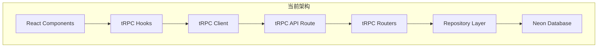
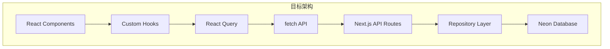

# Design Document - QMS 项目架构简化

## Overview

本设计文档描述了 QMS（被子管理系统）项目的架构简化方案。核心目标是移除 tRPC 框架，改用更简单直接的纯 REST API 架构，同时统一版本号管理和清理冗余代码。

**核心变更**：

1. 移除 tRPC，改用 Next.js API Routes + React Query
2. 统一版本号为 1.1.0，从 package.json 单一来源管理
3. 移除有安全风险的 executeQuery 函数
4. 清理通知系统和冗余文档

## Architecture

### 当前架构（使用 tRPC）



### 目标架构（纯 REST API）



### 架构对比

| 方面     | tRPC 架构  | REST API 架构 |
| -------- | ---------- | ------------- |
| 类型安全 | 自动端到端 | 手动定义类型  |
| 复杂度   | 高         | 低            |
| 学习曲线 | 陡峭       | 平缓          |
| 调试     | 困难       | 简单          |
| 依赖数量 | 5+ 包      | 0 额外包      |

## Components and Interfaces

### 需要删除的文件

#### tRPC 相关文件（12 个）

| 文件路径                                    | 说明                |
| ------------------------------------------- | ------------------- |
| `src/server/api/trpc.ts`                    | tRPC 初始化和中间件 |
| `src/server/api/root.ts`                    | tRPC 路由聚合       |
| `src/server/api/routers/quilts.ts`          | 被子 tRPC 路由      |
| `src/server/api/routers/usage.ts`           | 使用记录 tRPC 路由  |
| `src/server/api/routers/dashboard.ts`       | 仪表板 tRPC 路由    |
| `src/server/api/routers/settings.ts`        | 设置 tRPC 路由      |
| `src/server/api/routers/notifications.ts`   | 通知 tRPC 路由      |
| `src/server/api/routers/import-export.ts`   | 导入导出 tRPC 路由  |
| `src/app/api/trpc/[trpc]/route.ts`          | tRPC API 路由处理器 |
| `src/lib/trpc.ts`                           | tRPC 客户端配置     |
| `src/lib/trpc-provider.tsx`                 | tRPC Provider       |
| `src/components/providers/TRPCProvider.tsx` | tRPC Provider 组件  |

#### 通知系统相关文件（3 个）

| 文件路径                                          | 说明             |
| ------------------------------------------------- | ---------------- |
| `src/lib/notification-store.ts`                   | Zustand 通知存储 |
| `src/lib/repositories/notification.repository.ts` | 通知仓储         |
| `src/components/NotificationPanel.tsx`            | 通知面板组件     |

### 需要创建的 REST API 路由

#### 被子 API

```typescript
// src/app/api/quilts/route.ts
export async function GET(request: Request) {
  // 获取被子列表，支持过滤和分页
  const { searchParams } = new URL(request.url);
  const filters = {
    season: searchParams.get('season'),
    status: searchParams.get('status'),
    search: searchParams.get('search'),
    limit: parseInt(searchParams.get('limit') || '20'),
    offset: parseInt(searchParams.get('offset') || '0'),
  };

  const quilts = await quiltRepository.findAll(filters);
  const total = await quiltRepository.count(filters);

  return Response.json({ quilts, total });
}

export async function POST(request: Request) {
  // 创建新被子
  const data = await request.json();
  const quilt = await quiltRepository.create(data);
  return Response.json(quilt);
}
```

```typescript
// src/app/api/quilts/[id]/route.ts
export async function GET(request: Request, { params }: { params: { id: string } }) {
  const quilt = await quiltRepository.findById(params.id);
  if (!quilt) {
    return Response.json({ error: 'Not found' }, { status: 404 });
  }
  return Response.json(quilt);
}

export async function PUT(request: Request, { params }: { params: { id: string } }) {
  const data = await request.json();
  const quilt = await quiltRepository.update(params.id, data);
  return Response.json(quilt);
}

export async function DELETE(request: Request, { params }: { params: { id: string } }) {
  await quiltRepository.delete(params.id);
  return Response.json({ success: true });
}
```

#### 使用记录 API

```typescript
// src/app/api/usage/route.ts
// GET - 获取使用记录列表
// POST - 创建使用记录

// src/app/api/usage/[id]/route.ts
// GET - 获取单个使用记录
// PUT - 更新使用记录
// DELETE - 删除使用记录

// src/app/api/usage/active/route.ts
// GET - 获取所有活跃的使用记录
```

#### 仪表板 API

```typescript
// src/app/api/dashboard/route.ts
export async function GET() {
  const stats = await dashboardService.getStats();
  return Response.json(stats);
}
```

#### 设置 API

```typescript
// src/app/api/settings/route.ts
import packageJson from '../../../../package.json';

export async function GET() {
  const settings = await settingsRepository.getAll();
  return Response.json({
    ...settings,
    version: packageJson.version, // 从 package.json 读取版本号
  });
}

export async function PUT(request: Request) {
  const data = await request.json();
  const settings = await settingsRepository.update(data);
  return Response.json(settings);
}
```

### 需要重构的 Hooks

#### useQuilts Hook

```typescript
// src/hooks/useQuilts.ts
'use client';

import { useQuery, useMutation, useQueryClient } from '@tanstack/react-query';
import type { Quilt, QuiltFiltersInput } from '@/lib/validations/quilt';

const QUILTS_KEY = ['quilts'];

async function fetchQuilts(
  filters?: QuiltFiltersInput
): Promise<{ quilts: Quilt[]; total: number }> {
  const params = new URLSearchParams();
  if (filters?.season) params.set('season', filters.season);
  if (filters?.status) params.set('status', filters.status);
  if (filters?.search) params.set('search', filters.search);

  const response = await fetch(`/api/quilts?${params}`);
  if (!response.ok) throw new Error('Failed to fetch quilts');
  return response.json();
}

export function useQuilts(filters?: QuiltFiltersInput) {
  return useQuery({
    queryKey: [...QUILTS_KEY, filters],
    queryFn: () => fetchQuilts(filters),
    staleTime: 60000,
  });
}

export function useCreateQuilt() {
  const queryClient = useQueryClient();

  return useMutation({
    mutationFn: async (data: CreateQuiltInput) => {
      const response = await fetch('/api/quilts', {
        method: 'POST',
        headers: { 'Content-Type': 'application/json' },
        body: JSON.stringify(data),
      });
      if (!response.ok) throw new Error('Failed to create quilt');
      return response.json();
    },
    onSuccess: () => {
      queryClient.invalidateQueries({ queryKey: QUILTS_KEY });
      queryClient.invalidateQueries({ queryKey: ['dashboard'] });
    },
  });
}

// ... 其他 mutations
```

### 版本号管理方案

#### 单一来源：package.json

```json
{
  "name": "qms-app",
  "version": "1.1.0",
  ...
}
```

#### 设置 API 读取版本号

```typescript
// src/app/api/settings/system-info/route.ts
import packageJson from '../../../../../package.json';

export async function GET() {
  return Response.json({
    version: packageJson.version,
    framework: 'Next.js 16',
    deployment: 'Vercel',
    database: 'Neon PostgreSQL',
  });
}
```

#### 设置页面显示版本号

```typescript
// src/app/settings/page.tsx
const { data: systemInfo } = useQuery({
  queryKey: ['system-info'],
  queryFn: async () => {
    const response = await fetch('/api/settings/system-info');
    return response.json();
  },
});

// 显示版本号
<span>{systemInfo?.version}</span>
```

## Data Models

数据模型保持不变，继续使用现有的 Zod schemas 和 Repository 模式。

## Correctness Properties

_A property is a characteristic or behavior that should hold true across all valid executions of a system-essentially, a formal statement about what the system should do. Properties serve as the bridge between human-readable specifications and machine-verifiable correctness guarantees._

基于需求文档中的验收标准，以下是需要验证的正确性属性：

### Property 1: API Functionality Preservation

_For any_ quilt CRUD operation (create, read, update, delete), the REST API SHALL produce the same result as the previous tRPC implementation.
**Validates: Requirements 1.3**

### Property 2: Version Consistency

_For any_ request to the settings/system-info API, the returned version SHALL match the version in package.json.
**Validates: Requirements 6.2**

## Error Handling

### REST API 错误响应格式

```typescript
interface ApiErrorResponse {
  error: string;
  code: string;
  details?: Record<string, unknown>;
}

// 示例错误响应
{
  "error": "被子不存在",
  "code": "NOT_FOUND",
  "details": { "id": "xxx" }
}
```

### HTTP 状态码使用

| 状态码 | 使用场景     |
| ------ | ------------ |
| 200    | 成功         |
| 201    | 创建成功     |
| 400    | 请求参数错误 |
| 401    | 未认证       |
| 404    | 资源不存在   |
| 500    | 服务器错误   |

## Testing Strategy

### 测试框架

- **单元测试**: Vitest
- **属性测试**: fast-check (Property-Based Testing)

### 单元测试

单元测试覆盖以下场景：

1. **API 路由测试**
   - GET /api/quilts - 列表查询
   - POST /api/quilts - 创建
   - PUT /api/quilts/[id] - 更新
   - DELETE /api/quilts/[id] - 删除

2. **Hook 测试**
   - useQuilts 数据获取
   - useCreateQuilt mutation
   - useUpdateQuilt mutation
   - useDeleteQuilt mutation

3. **版本号测试**
   - 设置 API 返回正确版本号
   - 版本号与 package.json 一致

### 属性测试 (Property-Based Testing)

```typescript
import fc from 'fast-check';
import { describe, it, expect } from 'vitest';

// Property 1: API Functionality Preservation
// **Feature: code-review-phase2, Property 1: API Functionality Preservation**
describe('Quilt API', () => {
  it('should return created quilt with all fields', () => {
    fc.assert(
      fc.property(
        fc.record({
          season: fc.constantFrom('WINTER', 'SPRING_AUTUMN', 'SUMMER'),
          lengthCm: fc.integer({ min: 100, max: 300 }),
          widthCm: fc.integer({ min: 100, max: 300 }),
          weightGrams: fc.integer({ min: 100, max: 10000 }),
          fillMaterial: fc.string({ minLength: 1, maxLength: 50 }),
          color: fc.string({ minLength: 1, maxLength: 30 }),
          location: fc.string({ minLength: 1, maxLength: 100 }),
        }),
        async quiltData => {
          const response = await fetch('/api/quilts', {
            method: 'POST',
            headers: { 'Content-Type': 'application/json' },
            body: JSON.stringify(quiltData),
          });
          const created = await response.json();

          expect(created.season).toBe(quiltData.season);
          expect(created.lengthCm).toBe(quiltData.lengthCm);
          expect(created.widthCm).toBe(quiltData.widthCm);
        }
      )
    );
  });
});

// Property 2: Version Consistency
// **Feature: code-review-phase2, Property 2: Version Consistency**
describe('Version API', () => {
  it('should return version matching package.json', async () => {
    const packageJson = require('../../../package.json');
    const response = await fetch('/api/settings/system-info');
    const data = await response.json();

    expect(data.version).toBe(packageJson.version);
  });
});
```

### 测试覆盖目标

| 类别     | 覆盖率目标 |
| -------- | ---------- |
| API 路由 | 90%        |
| Hooks    | 80%        |
| 版本管理 | 100%       |

## Implementation Phases

### Phase 1: 版本号统一（高优先级）

1. 更新 package.json 版本号为 1.1.0
2. 更新 README.md 和 README_zh.md
3. 创建 /api/settings/system-info 路由
4. 更新设置页面从 API 获取版本号
5. 更新 CHANGELOG.md

### Phase 2: 创建 REST API 路由

1. 创建 /api/quilts 路由
2. 创建 /api/quilts/[id] 路由
3. 创建 /api/usage 路由
4. 创建 /api/usage/[id] 路由
5. 创建 /api/dashboard 路由
6. 更新 /api/settings 路由

### Phase 3: 重构 Hooks

1. 重构 useQuilts.ts
2. 重构 useUsage.ts
3. 重构 useDashboard.ts
4. 重构 useSettings.ts
5. 更新 layout.tsx 移除 TRPCProvider

### Phase 4: 删除 tRPC 相关代码

1. 删除 src/server/api/ 目录
2. 删除 src/app/api/trpc/ 目录
3. 删除 src/lib/trpc.ts
4. 删除 src/lib/trpc-provider.tsx
5. 删除 src/components/providers/TRPCProvider.tsx

### Phase 5: 清理依赖和代码

1. 移除 tRPC 相关依赖
2. 移除 executeQuery 函数
3. 删除通知系统相关代码
4. 清理未使用的代码

### Phase 6: 文档清理

1. 删除临时文档
2. 更新 docs/INDEX.md
3. 清理 scripts 目录

---

**设计版本**: 1.0  
**创建日期**: 2025-12-11  
**基于需求版本**: 1.0
