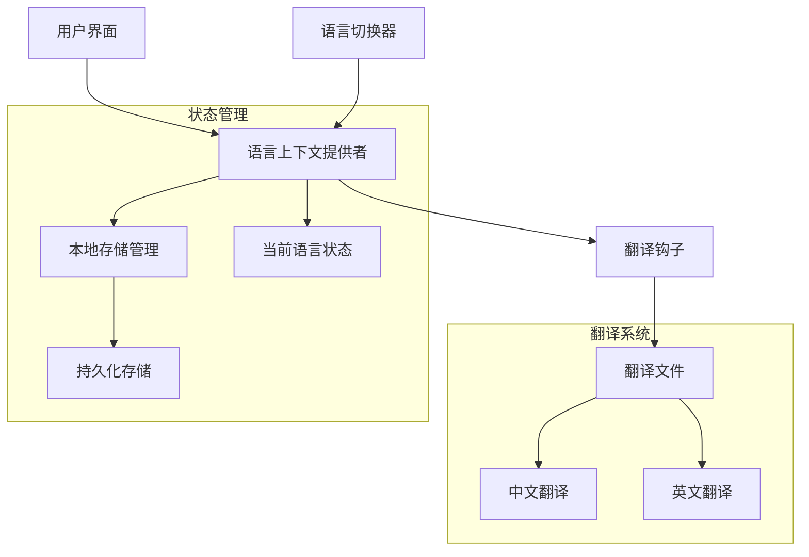

# 多语言支持设计文档

## 概述

本设计文档描述了为被子管理系统（QMS）实现多语言支持的技术架构和实现方案。系统将支持简体中文（默认）和英文，提供完整的用户界面本地化体验。

## 架构设计

### 核心架构



### 技术栈选择

- **React Context API**: 全局语言状态管理
- **TypeScript**: 类型安全的翻译系统
- **localStorage**: 语言偏好持久化
- **自定义Hook**: 翻译功能封装

## 组件和接口设计

### 1. 翻译系统核心接口

```typescript
// 支持的语言类型
export type Language = 'zh' | 'en';

// 翻译内容接口
export interface Translations {
  [key: string]: string | Translations;
}

// 语言上下文接口
export interface LanguageContextType {
  language: Language;
  setLanguage: (lang: Language) => void;
  t: (key: string) => string;
}
```

### 2. 翻译文件结构

```typescript
export const translations = {
  zh: {
    // 导航和通用
    navigation: {
      dashboard: '仪表板',
      quilts: '被子管理',
      usage: '使用跟踪',
      settings: '设置',
    },
    // 仪表板
    dashboard: {
      title: '被子管理系统',
      subtitle: '管理您的被子收藏和使用情况',
      stats: {
        totalQuilts: '被子总数',
        inUse: '使用中',
        available: '可用',
        storage: '存储中',
      },
    },
    // 其他模块...
  },
  en: {
    // 对应的英文翻译...
  },
};
```

### 3. 语言上下文提供者

```typescript
export function LanguageProvider({ children }: { children: React.ReactNode }) {
  const [language, setLanguage] = useState<Language>('zh');

  // 从localStorage加载语言偏好
  useEffect(() => {
    const savedLanguage = localStorage.getItem('language') as Language;
    if (savedLanguage && ['zh', 'en'].includes(savedLanguage)) {
      setLanguage(savedLanguage);
    }
  }, []);

  // 保存语言偏好
  const handleSetLanguage = (lang: Language) => {
    setLanguage(lang);
    localStorage.setItem('language', lang);
  };

  // 翻译函数
  const t = (key: string): string => {
    return getNestedTranslation(translations[language], key) || key;
  };

  return (
    <LanguageContext.Provider value={{ language, setLanguage: handleSetLanguage, t }}>
      {children}
    </LanguageContext.Provider>
  );
}
```

### 4. 语言切换器组件

```typescript
export function LanguageSwitcher() {
  const { language, setLanguage } = useLanguage();

  return (
    <Button
      variant="outline"
      size="sm"
      onClick={() => setLanguage(language === 'zh' ? 'en' : 'zh')}
    >
      <Globe className="w-4 h-4 mr-2" />
      {language === 'zh' ? '中文' : 'EN'}
    </Button>
  );
}
```

## 数据模型

### 翻译键命名规范

- 使用点分隔的层级结构：`module.section.item`
- 示例：
  - `dashboard.title` - 仪表板标题
  - `quilts.actions.add` - 被子页面添加按钮
  - `status.AVAILABLE` - 可用状态
  - `season.WINTER` - 冬季

### 枚举值翻译映射

```typescript
// 状态翻译
export const statusTranslations = {
  AVAILABLE: 'status.AVAILABLE',
  IN_USE: 'status.IN_USE',
  STORAGE: 'status.STORAGE',
  MAINTENANCE: 'status.MAINTENANCE',
};

// 季节翻译
export const seasonTranslations = {
  WINTER: 'season.WINTER',
  SPRING_AUTUMN: 'season.SPRING_AUTUMN',
  SUMMER: 'season.SUMMER',
};
```

## 错误处理

### 翻译缺失处理

1. **后备机制**: 如果翻译键不存在，显示键名本身
2. **开发模式警告**: 在开发环境中记录缺失的翻译键
3. **类型检查**: 使用TypeScript确保翻译键的类型安全

```typescript
const t = (key: string): string => {
  const translation = getNestedTranslation(translations[language], key);

  if (!translation) {
    if (process.env.NODE_ENV === 'development') {
      console.warn(`Missing translation for key: ${key}`);
    }
    return key;
  }

  return translation;
};
```

### 语言切换错误处理

1. **无效语言处理**: 如果localStorage中的语言无效，回退到默认语言
2. **存储失败处理**: 如果localStorage不可用，仅在内存中保持语言状态
3. **渲染错误处理**: 使用错误边界捕获翻译相关的渲染错误

## 测试策略

### 单元测试

1. **翻译函数测试**
   - 测试正确的翻译键返回对应翻译
   - 测试不存在的翻译键返回键名
   - 测试嵌套翻译键的解析

2. **语言切换测试**
   - 测试语言切换功能
   - 测试localStorage的读写
   - 测试默认语言设置

3. **组件测试**
   - 测试LanguageSwitcher组件的渲染和交互
   - 测试翻译内容在组件中的正确显示

### 集成测试

1. **页面级翻译测试**
   - 测试各页面在不同语言下的正确显示
   - 测试动态内容的翻译更新

2. **用户流程测试**
   - 测试完整的语言切换用户流程
   - 测试语言偏好的持久化

### 性能测试

1. **翻译加载性能**
   - 测试翻译文件的加载时间
   - 测试语言切换的响应时间

2. **内存使用测试**
   - 测试翻译数据的内存占用
   - 测试长时间使用后的内存泄漏

## 实现注意事项

### 性能优化

1. **翻译预加载**: 在应用启动时预加载所有翻译内容
2. **翻译缓存**: 缓存已解析的翻译结果
3. **按需加载**: 考虑未来支持更多语言时的按需加载机制

### 可维护性

1. **翻译文件分割**: 按功能模块分割大型翻译文件
2. **翻译键验证**: 实现翻译键的完整性检查工具
3. **自动化测试**: 确保所有翻译键都有对应的翻译内容

### 扩展性

1. **插件化设计**: 为未来添加更多语言预留扩展接口
2. **格式化支持**: 支持数字、日期等的本地化格式
3. **复数形式**: 为未来支持复数形式翻译预留设计空间

## 部署考虑

### 构建优化

1. **翻译文件压缩**: 在生产构建中压缩翻译文件
2. **Tree Shaking**: 确保未使用的翻译内容被正确移除
3. **代码分割**: 考虑将翻译内容作为独立chunk加载

### 监控和分析

1. **使用统计**: 收集不同语言的使用统计
2. **错误监控**: 监控翻译相关的错误和警告
3. **性能监控**: 监控语言切换的性能指标
