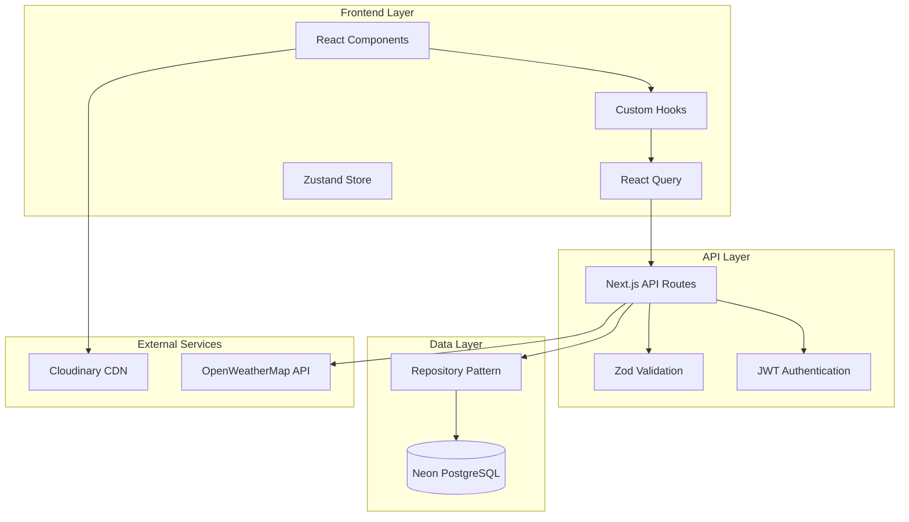

# Design Document - QMS 2026 全面项目审查

## Overview

本设计文档详细描述 QMS 项目 2026 年全面审查的技术方案，涵盖技术栈升级、代码优化、文档更新和 UI/UX 改进四大领域。

### 项目现状分析

**当前技术栈**：

- Next.js 16.0.7 (App Router)
- React 19.2.1
- TypeScript 5.6.3
- Tailwind CSS 4.1.17
- React Query 5.90.12
- Framer Motion 12.23.25
- Zod 4.1.13
- Zustand 5.0.8
- Neon PostgreSQL (Serverless)

**架构特点**：

- REST API + React Query 数据获取
- Repository 模式数据访问层
- 双语支持 (中文/英文)
- JWT 认证 + bcrypt 密码加密
- Radix UI 组件库

### 审查目标

1. **技术栈升级**：确保使用最新稳定版本，采用 React 19 和 Next.js 16 新特性
2. **代码优化**：消除冗余代码，提升代码质量和可维护性
3. **文档更新**：确保文档准确反映当前架构
4. **UI/UX 改进**：应用 UI/UX Pro Max 设计指南，提升用户体验

---

## Architecture

### 系统架构图



### 目录结构优化

```
src/
├── app/                    # Next.js App Router
│   ├── api/               # API Routes
│   ├── (auth)/            # 认证相关页面
│   └── (dashboard)/       # 仪表板页面
├── components/
│   ├── ui/                # 基础 UI 组件
│   ├── motion/            # 动画组件
│   ├── dashboard/         # 仪表板组件
│   ├── quilts/            # 被子管理组件
│   └── usage/             # 使用记录组件
├── hooks/                 # 自定义 Hooks
├── lib/
│   ├── repositories/      # 数据仓储
│   ├── validations/       # Zod 验证
│   └── utils/             # 工具函数
└── types/                 # TypeScript 类型
```

---

## Components and Interfaces

### 1. React 19 新特性集成

#### useActionState Hook 集成

```typescript
// src/hooks/useFormAction.ts
import { useActionState } from 'react';

interface FormState<T> {
  data?: T;
  error?: string;
  success?: boolean;
}

export function useFormAction<T>(
  action: (prevState: FormState<T>, formData: FormData) => Promise<FormState<T>>
) {
  const [state, formAction, isPending] = useActionState(action, {});
  return { state, formAction, isPending };
}
```

#### useOptimistic Hook 集成

```typescript
// src/hooks/useOptimisticUpdate.ts
import { useOptimistic } from 'react';

export function useOptimisticList<T extends { id: string }>(
  items: T[],
  updateFn: (items: T[], action: { type: string; item: T }) => T[]
) {
  const [optimisticItems, addOptimistic] = useOptimistic(items, updateFn);
  return { optimisticItems, addOptimistic };
}
```

### 2. API 路由优化接口

```typescript
// src/lib/api/response.ts
interface ApiResponse<T> {
  success: boolean;
  data?: T;
  error?: {
    code: string;
    message: string;
    details?: Record<string, unknown>;
  };
  meta?: {
    page?: number;
    limit?: number;
    total?: number;
    hasMore?: boolean;
  };
}

// 统一响应构建器
export function createSuccessResponse<T>(data: T, meta?: ApiResponse<T>['meta']): ApiResponse<T>;
export function createErrorResponse(
  code: string,
  message: string,
  details?: Record<string, unknown>
): ApiResponse<never>;
```

### 3. Repository 模式增强

```typescript
// src/lib/repositories/enhanced-base.repository.ts
export abstract class EnhancedBaseRepository<TRow, TModel> extends BaseRepositoryImpl<
  TRow,
  TModel
> {
  // 分页查询
  abstract findPaginated(options: PaginationOptions): Promise<PaginatedResult<TModel>>;

  // 批量操作
  abstract createMany(items: Partial<TModel>[]): Promise<TModel[]>;
  abstract updateMany(ids: string[], data: Partial<TModel>): Promise<number>;
  abstract deleteMany(ids: string[]): Promise<number>;

  // 聚合查询
  abstract countBy(field: keyof TModel): Promise<Record<string, number>>;
}
```

---

## Data Models

### 现有数据模型

```typescript
// src/types/quilt.ts
interface Quilt {
  id: string;
  itemNumber: string;
  name: string;
  season: 'WINTER' | 'SPRING_AUTUMN' | 'SUMMER' | 'ALL_SEASON';
  currentStatus: 'IN_USE' | 'STORAGE' | 'MAINTENANCE';
  lengthCm: number;
  widthCm: number;
  weightGrams: number;
  fillMaterial: string;
  coverMaterial: string;
  brand: string;
  location: string;
  purchaseDate?: Date;
  mainImage?: string;
  attachmentImages?: string[];
  notes?: string;
  createdAt: Date;
  updatedAt: Date;
}

interface UsageRecord {
  id: string;
  quiltId: string;
  startDate: Date;
  endDate?: Date;
  usageType: 'REGULAR' | 'GUEST' | 'SPECIAL_OCCASION' | 'SEASONAL_ROTATION';
  status: 'ACTIVE' | 'COMPLETED';
  notes?: string;
  createdAt: Date;
  updatedAt: Date;
}
```

### 数据验证 Schema

```typescript
// src/lib/validations/quilt.ts
import { z } from 'zod';

export const quiltSchema = z.object({
  name: z.string().min(1).max(100),
  season: z.enum(['WINTER', 'SPRING_AUTUMN', 'SUMMER', 'ALL_SEASON']),
  currentStatus: z.enum(['IN_USE', 'STORAGE', 'MAINTENANCE']),
  lengthCm: z.number().int().positive().max(500),
  widthCm: z.number().int().positive().max(500),
  weightGrams: z.number().int().positive().max(10000),
  fillMaterial: z.string().min(1).max(50),
  coverMaterial: z.string().min(1).max(50),
  brand: z.string().max(50).default('无品牌'),
  location: z.string().max(100).default('未存储'),
  purchaseDate: z.date().optional(),
  notes: z.string().max(500).optional(),
});
```

---

## Correctness Properties

_A property is a characteristic or behavior that should hold true across all valid executions of a system—essentially, a formal statement about what the system should do. Properties serve as the bridge between human-readable specifications and machine-verifiable correctness guarantees._

### Property 1: Code Cleanliness - No Unused Code

_For any_ TypeScript/JavaScript file in the src directory, running ESLint with no-unused-vars rule SHALL report zero violations after code cleanup.

**Validates: Requirements 4.1, 4.6**

### Property 2: Code DRY-ness - No Duplicate Code

_For any_ code block longer than 10 lines, there SHALL NOT exist another code block with more than 80% similarity in the same codebase.

**Validates: Requirements 4.2, 4.7**

### Property 3: TypeScript Type Safety

_For any_ TypeScript file in the project, running `tsc --noEmit` SHALL produce zero type errors.

**Validates: Requirements 4.4**

### Property 4: API Response Consistency

_For any_ API route in src/app/api, the response format SHALL conform to the ApiResponse interface with success, data/error, and optional meta fields.

**Validates: Requirements 5.3**

### Property 5: Zod Validation Coverage

_For any_ API route that accepts user input, there SHALL exist a corresponding Zod schema that validates the input before processing.

**Validates: Requirements 5.4**

### Property 6: Repository Pattern Compliance

_For any_ database operation in the codebase, it SHALL be performed through a repository class that extends BaseRepositoryImpl.

**Validates: Requirements 6.1, 6.2**

### Property 7: SQL Injection Prevention

_For any_ SQL query in the codebase, it SHALL use parameterized queries (Neon sql template literal) instead of string concatenation.

**Validates: Requirements 6.4**

### Property 8: Accessibility Compliance

_For any_ interactive UI component, it SHALL pass axe-core accessibility tests with zero critical or serious violations.

**Validates: Requirements 8.2, 9.7**

### Property 9: Design Token Usage

_For any_ color, spacing, or typography value in CSS/Tailwind classes, it SHALL reference a design token variable instead of hardcoded values.

**Validates: Requirements 8.4, 9.2, 9.3**

### Property 10: No Layout Shift on Hover

_For any_ element with hover state, the hover effect SHALL NOT change the element's dimensions (width, height, margin, padding).

**Validates: Requirements 9.5**

### Property 11: SVG Icons Only

_For any_ icon usage in UI components, it SHALL use Lucide React SVG icons, NOT emoji characters.

**Validates: Requirements 9.6**

### Property 12: Image Optimization

_For any_ image rendered in the application, it SHALL use Next.js Image component with lazy loading enabled.

**Validates: Requirements 10.5**

### Property 13: Input Sanitization

_For any_ user input processed by API routes, it SHALL be sanitized using the sanitization utility before database operations.

**Validates: Requirements 11.1**

### Property 14: Secure Password Storage

_For any_ password stored in the database, it SHALL be hashed using bcrypt with salt rounds >= 10.

**Validates: Requirements 11.2**

### Property 15: Secure Cookie Configuration

_For any_ authentication cookie set by the application, it SHALL have httpOnly=true and secure=true flags.

**Validates: Requirements 11.3**

### Property 16: Project Structure Cleanliness

_For any_ directory in the project, it SHALL NOT be empty (contain at least one file or meaningful subdirectory).

**Validates: Requirements 13.1, 13.4**

### Property 17: Internationalization Completeness

_For any_ translation key in the Chinese translation file, there SHALL exist a corresponding key with non-empty value in the English translation file, and vice versa.

**Validates: Requirements 14.2, 14.5**

### Property 18: Locale-Aware Formatting

_For any_ date or number displayed in the UI, it SHALL use locale-aware formatting functions with the current language setting.

**Validates: Requirements 14.3, 14.4**

---

## Error Handling

### 错误处理策略

```typescript
// src/lib/error-handler.ts
export const ErrorCodes = {
  // 验证错误
  VALIDATION_FAILED: 'VALIDATION_FAILED',
  INVALID_INPUT: 'INVALID_INPUT',

  // 认证错误
  UNAUTHORIZED: 'UNAUTHORIZED',
  FORBIDDEN: 'FORBIDDEN',
  TOKEN_EXPIRED: 'TOKEN_EXPIRED',

  // 数据库错误
  DB_CONNECTION_FAILED: 'DB_CONNECTION_FAILED',
  DB_QUERY_FAILED: 'DB_QUERY_FAILED',
  DB_TRANSACTION_FAILED: 'DB_TRANSACTION_FAILED',

  // 业务错误
  NOT_FOUND: 'NOT_FOUND',
  CONFLICT: 'CONFLICT',
  RATE_LIMITED: 'RATE_LIMITED',
} as const;

// 错误响应格式
interface ErrorResponse {
  success: false;
  error: {
    code: string;
    message: string;
    details?: Record<string, unknown>;
  };
}
```

### 错误边界组件

```typescript
// src/components/ErrorBoundary.tsx
export function ErrorBoundary({ children }: { children: React.ReactNode }) {
  return (
    <ErrorBoundaryPrimitive
      fallback={({ error, resetErrorBoundary }) => (
        <ErrorFallback error={error} onReset={resetErrorBoundary} />
      )}
    >
      {children}
    </ErrorBoundaryPrimitive>
  );
}
```

---

## Testing Strategy

### 测试类型

1. **单元测试**：测试独立函数和工具
2. **属性测试**：验证系统属性在所有输入下成立
3. **集成测试**：测试 API 路由和数据库交互
4. **组件测试**：测试 React 组件渲染和交互
5. **E2E 测试**：测试完整用户流程

### 测试框架

- **Vitest**：单元测试和属性测试
- **fast-check**：属性测试生成器
- **Testing Library**：组件测试
- **Playwright**：E2E 测试

### 属性测试配置

```typescript
// vitest.config.ts
export default defineConfig({
  test: {
    // 属性测试最少运行 100 次
    fuzz: {
      numRuns: 100,
    },
  },
});
```

### 测试覆盖率目标

| 类型     | 目标覆盖率 |
| -------- | ---------- |
| 语句覆盖 | 60%        |
| 分支覆盖 | 50%        |
| 函数覆盖 | 70%        |
| 行覆盖   | 60%        |

---

## UI/UX 设计指南

### 设计系统

基于 UI/UX Pro Max 研究结果，采用以下设计方案：

#### 产品类型

- **类型**：Analytics Dashboard / Inventory Management
- **风格**：Minimalism & Swiss Style
- **特点**：Clean, simple, spacious, functional, high contrast

#### 颜色方案

| 用途       | 颜色         | Hex     |
| ---------- | ------------ | ------- |
| Primary    | Trust Blue   | #2563EB |
| Secondary  | Light Blue   | #3B82F6 |
| CTA        | Orange       | #F97316 |
| Background | Light Gray   | #F8FAFC |
| Text       | Dark Slate   | #1E293B |
| Border     | Light Border | #E2E8F0 |

#### 字体方案

- **标题字体**：Poppins (sans-serif)
- **正文字体**：Open Sans (sans-serif)
- **中文字体**：Noto Sans SC

```css
@import url('https://fonts.googleapis.com/css2?family=Open+Sans:wght@300;400;500;600;700&family=Poppins:wght@400;500;600;700&family=Noto+Sans+SC:wght@300;400;500;700&display=swap');
```

#### 动画指南

- **过渡时长**：150-300ms
- **缓动函数**：ease-out (进入), ease-in (退出)
- **尊重用户偏好**：检查 `prefers-reduced-motion`

```css
@media (prefers-reduced-motion: reduce) {
  * {
    animation-duration: 0.01ms !important;
    transition-duration: 0.01ms !important;
  }
}
```

#### 交互规范

| 元素       | 规范                                |
| ---------- | ----------------------------------- |
| 可点击元素 | 必须有 `cursor-pointer`             |
| Hover 状态 | 使用颜色/透明度变化，不改变尺寸     |
| 过渡效果   | 150-300ms，使用 ease-out            |
| 图标       | 使用 Lucide React SVG，不使用 emoji |

---

## 实施计划

### 阶段 1：技术栈评估与升级 (1-2 天)

1. 检查依赖版本
2. 评估升级风险
3. 执行依赖升级
4. 验证功能正常

### 阶段 2：代码质量优化 (2-3 天)

1. 运行 ESLint 修复
2. 识别并消除重复代码
3. 优化 API 路由
4. 完善 Repository 模式

### 阶段 3：安全性审查 (1 天)

1. 验证输入验证
2. 检查认证流程
3. 审查错误处理
4. 验证安全头配置

### 阶段 4：UI/UX 改进 (2-3 天)

1. 应用设计系统
2. 优化组件样式
3. 改进响应式设计
4. 增强可访问性

### 阶段 5：文档更新 (1 天)

1. 更新 README
2. 更新 CHANGELOG
3. 清理过时文档
4. 同步中英文文档

### 阶段 6：测试与验证 (1-2 天)

1. 运行现有测试
2. 添加属性测试
3. 执行性能测试
4. 验证所有属性

---

**文档版本**: 1.0
**创建日期**: 2026-01-07
**设计状态**: 待审核
